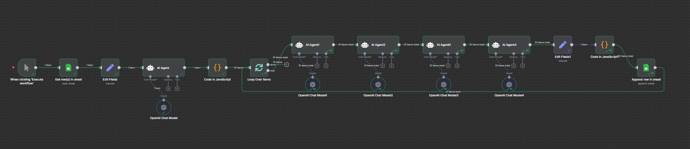

# 🧩 Parte 3 — Geração Final de Conteúdos (Ideias, Títulos, Roteiros e Thumbnails)

 


## 📋 Visão Geral

Esta automação é a **etapa final do pipeline**, responsável por transformar as **lacunas temáticas** identificadas anteriormente (Parte 4 da automação anterior) em **conteúdos completos de YouTube**, incluindo:

* Geração de ideias de vídeo;
* Criação de títulos otimizados com gatilhos e estrutura de alta performance;
* Avaliação de potencial viral;
* Escrita do roteiro completo;
* Criação de conceitos de thumbnails;
* Registro automático de todos os resultados na planilha **“Conteúdo”**.

> É um fluxo **único e linear**, com uma sequência de nós que executa todo o processo de ideação até o registro final.

---

## 🔄 Fluxo de Execução

```
Manual Trigger (Execução manual)
→ Get row(s) in sheet (Identificação de padrões)
→ Edit Fields (normalização de dados)
→ AI Agent1 (Geração de ideias brutas)
→ Code (explode ideias em múltiplos registros)
→ Loop Over Items (processa cada ideia)
   ├─ AI Agent2 (Criação de título otimizado)
   ├─ AI Agent3 (Avaliação de potencial viral)
   ├─ AI Agent4 (Geração de roteiro completo)
   ├─ AI Agent5 (Geração de conceitos de thumbnail)
   ├─ Code (consolidação dos resultados)
→ Append row in sheet (registro final em “Conteúdo”)
```

---

## 📦 Nós do Workflow (passo a passo detalhado)

### 1) **Manual Trigger**

**Tipo:** `manualTrigger`
**Função:**
Inicia o fluxo sob demanda.
O acionamento é feito pelo operador diretamente no editor do n8n, permitindo reprocessar quando necessário.

---

### 2) **Get row(s) in sheet**

**Tipo:** `googleSheets (Read)`
**Documento:** `Teste Dev IA Pleno` (`1XlZTABwHA456bYCFRiS8BFLxynypmo65pXeBeRV1WkQ`)
**Aba:** **Identificação de padrões** (`gid=1109606750`)

**Função:**
Lê os campos consolidados das análises anteriores, incluindo:

* `Lacunas` (lista de oportunidades temáticas)
* `TituloPositivo` / `TituloNegativo` (referências de padrões de headline)
* `Roteiro` (estrutura narrativa ideal)
* `Thumb` (padrões visuais dominantes)

Essas informações formam a **base contextual** para a criação dos novos conteúdos.

---

### 3) **Edit Fields**

**Tipo:** `set`
**Função:**
Normaliza o formato dos campos e garante compatibilidade com os agentes seguintes.
Mapeia campos como:

* `lacunas` = `{{$json.Lacunas}}`
* `row_number` = `{{$json.row_number}}`

---

### 4) **AI Agent1 — Gerador de Ideias Brutas**

**Tipo:** `@n8n/n8n-nodes-langchain.agent`
**Modelo:** `gpt-4o-mini`
**Entrada:** dados de `Lacunas` (tema, concorrência, exemplos, score, p75/p90).
**Saída esperada:** até 15 ideias iniciais por execução.

**Função:**
Converter as **lacunas temáticas** detectadas em ideias concretas de vídeos, com ângulo emocional, diferencial e formato sugerido (lista, alerta, educativo etc.).

📍 **Prompt (preencher manualmente):**

```
[COLE AQUI O PROMPT DO AGENTE DE IDEIAS]
```

---

### 5) **Code — Explosão das ideias em múltiplos registros**

**Tipo:** `code (JavaScript)`
**Função:**
Recebe o JSON com as ideias brutas e **separa cada uma em um item individual** para processamento independente nos próximos nós.

Exemplo simplificado:

```js
const ideias = $json.ideias || [];
return ideias.map((item, i) => ({ json: item }));
```

---

### 6) **Loop Over Items**

**Tipo:** `splitInBatches`
**Função:**
Itera sobre cada ideia individualmente, permitindo processamento paralelo dos agentes de conteúdo.

---

### 7) **AI Agent2 — Arquiteto de Títulos de Alta Performance**

**Tipo:** `@n8n/n8n-nodes-langchain.agent`
**Modelo:** `gpt-4o-mini`
**Função:**
Gerar **título final otimizado** a partir da ideia.
O agente aplica padrões de performance encontrados na Parte 1 (estrutura + gatilhos + número).

📍 **Prompt (preencher manualmente):**

```
[COLE AQUI O PROMPT DO AGENTE DE TÍTULOS]
```

**Saída esperada (JSON):**

```json
{
  "titulo": "Alimentos que reconstróem força nas pernas em 30 segundos",
  "estrutura": "Gatilho + Benefício + Número + Solução",
  "gatilho": "curiosidade",
  "palavras_chave": ["pernas", "força", "alimentação"]
}
```

---

### 8) **AI Agent3 — Avaliador de Potencial Viral**

**Tipo:** `@n8n/n8n-nodes-langchain.agent`
**Modelo:** `gpt-4o-mini`
**Função:**
Atribuir **pontuação (60–95)** e **justificativa técnica** ao título criado, baseando-se nas métricas extraídas dos benchmarks (p75/p90, outlierScoreMedio, concorrência).

📍 **Prompt (preencher manualmente):**

```
[COLE AQUI O PROMPT DO AVALIADOR DE POTENCIAL VIRAL]
```

**Saída esperada (JSON):**

```json
{
  "titulo": "Alimentos que reconstróem força nas pernas em 30 segundos",
  "score": 92,
  "justificativa": "Alta clareza, promessa temporal, baixa concorrência.",
  "concorrencia": "baixa",
  "elementos_fortes": ["benefício direto", "número", "gatilho de urgência"]
}
```

---

### 9) **AI Agent4 — Roteirista de Conteúdo Viral**

**Tipo:** `@n8n/n8n-nodes-langchain.agent`
**Modelo:** `gpt-4.1-mini`
**Função:**
Gerar **roteiro completo de vídeo** com base no título aprovado e nos padrões narrativos extraídos na Parte 3 anterior.

📍 **Prompt (preencher manualmente):**

```
[COLE AQUI O PROMPT DO ROTEIRISTA]
```

**Estrutura obrigatória do roteiro:**

1. **Abertura:** gancho emocional (impacto imediato)
2. **Contexto:** apresentação do problema
3. **Solução:** explicação prática
4. **Prova ou reforço:** estatística, analogia ou dica extra
5. **Encerramento:** resumo + chamada de ação leve

**Saída esperada (JSON):**

```json
{
  "roteiro": "Você sente que suas pernas estão mais fracas?...",
  "estrutura_detectada": "Abertura com dor + Solução + Encerramento emocional",
  "duração_estimada": "5 minutos"
}
```

---

### 10) **AI Agent5 — Designer de Thumbnails**

**Tipo:** `@n8n/n8n-nodes-langchain.agent`
**Modelo:** `gpt-4.1-mini`
**Função:**
Gerar **3 conceitos visuais detalhados** de thumbnail para o vídeo, baseando-se no título e roteiro.

📍 **Prompt (preencher manualmente):**

```
[COLE AQUI O PROMPT DO DESIGNER DE THUMBNAILS]
```

**Saída esperada (JSON):**

```json
{
  "conceitos": [
    {
      "descricao": "Homem de 60 anos subindo escada com energia...",
      "texto_thumb": "FORÇA EM 30s",
      "emoção": "superação",
      "cores": ["vermelho", "branco"],
      "gancho_visual": "close-up nas pernas com luz intensa"
    },
    ...
  ]
}
```

---

### 11) **Code — Consolidação dos Resultados**

**Tipo:** `code (JavaScript)`
**Função:**
Junta todos os resultados (título, score, roteiro, thumbnails) em um único objeto consolidado, pronto para registro no Google Sheets.

Exemplo de consolidação:

```js
return [{
  json: {
    data: new Date().toISOString(),
    titulo: $json.titulo,
    score: $json.score,
    roteiro: $json.roteiro,
    thumbs: $json.conceitos
  }
}];
```

---

### 12) **Append row in sheet — Registro Final**

**Tipo:** `googleSheets (Write)`
**Documento:** `Teste Dev IA Pleno`
**Aba:** **Conteúdo**

**Função:**
Adiciona automaticamente uma nova linha com todas as informações do vídeo criado, incluindo:

* Data
* Ideia / Lacuna original
* Título final
* Score
* Justificativa
* Roteiro completo
* Conceitos de Thumbnail
* Palavras-chave
* Estrutura aplicada

---

## 🧪 O que é verificado / limitado

* Cada execução pode gerar **até 15 ideias** → processadas individualmente.
* Cada ideia percorre toda a cadeia de agentes até o registro final.
* Todos os blocos de IA seguem formato JSON e exigem **prompt manual**.
* Não há corte de 50 registros aqui — o limite vem do **número de ideias** geradas por ciclo.
* O fluxo grava automaticamente em **“Conteúdo”**, criando histórico cumulativo.

---

## 🗂️ Planilhas envolvidas

| Nome                         | Função                                              | gid                   |
| ---------------------------- | --------------------------------------------------- | --------------------- |
| **Identificação de padrões** | Fonte de dados (Lacunas, Títulos, Roteiros, Thumbs) | 1109606750            |
| **Conteúdo**                 | Destino final com todas as saídas consolidadas      | *(definida no fluxo)* |

---

## ✅ Resultado

A automação consolida todo o trabalho anterior em **um produto final pronto para publicação**, automatizando completamente a **linha editorial de vídeos** do nicho analisado.
Para cada lacuna, ela entrega:

* **Ideia criativa**
* **Título otimizado e pontuado**
* **Roteiro completo (copywriting narrativo)**
* **3 conceitos de Thumbnail prontos para produção**
* **Registro completo no Sheets**, pronto para análise e uso em campanhas.

---

Deseja que eu monte agora o **resumo final do projeto completo (Parte 1 → Parte 2 → Parte 3)**, mostrando o **encadeamento entre análises, identificação de padrões e geração de conteúdo final**?
Isso ficaria como o **fechamento oficial da documentação**.
