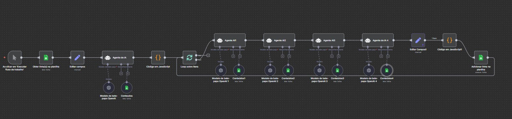

# 🧩 Parte 3 — Geração Final de Conteúdos (Ideias, Títulos, Roteiros e Thumbnails)

 


## 📋 Visão Geral

Esta automação é a **etapa final do pipeline**, responsável por transformar as **lacunas temáticas** identificadas anteriormente (Parte 4 da automação anterior) em **conteúdos completos de YouTube**, incluindo:

* Geração de ideias de vídeo;
* Criação de títulos otimizados com gatilhos e estrutura de alta performance;
* Avaliação de potencial viral;
* Escrita do roteiro completo;
* Criação de conceitos de thumbnails;
* Registro automático de todos os resultados na planilha **“Conteúdo”**.

> É um fluxo **único e linear**, com uma sequência de nós que executa todo o processo de ideação até o registro final.

---

## 🔄 Fluxo de Execução

```
Manual Trigger (Execução manual)
→ Get row(s) in sheet (Identificação de padrões)
→ Edit Fields (normalização de dados)
→ AI Agent1 (Geração de ideias brutas)
→ Code (explode ideias em múltiplos registros)
→ Loop Over Items (processa cada ideia)
   ├─ AI Agent2 (Criação de título otimizado)
   ├─ AI Agent3 (Avaliação de potencial viral)
   ├─ AI Agent4 (Geração de roteiro completo)
   ├─ AI Agent5 (Geração de conceitos de thumbnail)
   ├─ Code (consolidação dos resultados)
→ Append row in sheet (registro final em “Conteúdo”)
```

---

## 📦 Nós do Workflow (passo a passo detalhado)

### 1) **Manual Trigger**

**Tipo:** `manualTrigger`
**Função:**
Inicia o fluxo sob demanda.
O acionamento é feito pelo operador diretamente no editor do n8n, permitindo reprocessar quando necessário.

---

### 2) **Get row(s) in sheet**

**Tipo:** `googleSheets (Read)`
**Documento:** `Teste Dev IA Pleno` (`1XlZTABwHA456bYCFRiS8BFLxynypmo65pXeBeRV1WkQ`)
**Aba:** **Identificação de padrões** (`gid=1109606750`)

**Função:**
Lê os campos consolidados das análises anteriores, incluindo:

* `Lacunas` (lista de oportunidades temáticas)
* `TituloPositivo` / `TituloNegativo` (referências de padrões de headline)
* `Roteiro` (estrutura narrativa ideal)
* `Thumb` (padrões visuais dominantes)

Essas informações formam a **base contextual** para a criação dos novos conteúdos.

---

### 3) **Edit Fields**

**Tipo:** `set`
**Função:**
Normaliza o formato dos campos e garante compatibilidade com os agentes seguintes.
Mapeia campos como:

* `lacunas` = `{{$json.Lacunas}}`
* `row_number` = `{{$json.row_number}}`

---

### 4) **AI Agent1 — Gerador de Ideias Brutas**

**Tipo:** `@n8n/n8n-nodes-langchain.agent`
**Modelo:** `gpt-4o-mini`
**Entrada:** dados de `Lacunas` (tema, concorrência, exemplos, score, p75/p90).
**Saída esperada:** até 15 ideias iniciais por execução.

**Função:**
Converter as **lacunas temáticas** detectadas em ideias concretas de vídeos, com ângulo emocional, diferencial e formato sugerido (lista, alerta, educativo etc.).

📍 **Prompt:**

```
🧩 Agente 1 – "Gerador de Ideias Brutas"

Função: Pegar as lacunas (já filtradas e com dados) e gerar a ideia central do vídeo, sem título nem copy.

<role>
Você é um Gerador de Ideias Brutas para vídeos do YouTube.
</role>

<input>
Você receberá uma lista de lacunas identificadas automaticamente, com:
- tema
- videosExistentes
- concorrencia
- outlierScoreMedio
- exemplos

Você NÃO deve criar título nem copy.  
Seu trabalho é identificar **qual insight ou abordagem** poderia virar um vídeo de alto potencial.
</input>

<task>
Para cada lacuna, gere **1 insight de conteúdo**.

Descreva:
- **idéia_central:** conceito bruto do vídeo
- **ângulo:** que emoção ou valor ela ativa (ex: curiosidade, medo, autoridade)
- **formato_sugerido:** ex: lista, rotina, teste rápido, alerta, antes/depois
- **tema_principal:** alimento, exercício, vitamina, sintoma etc.
- **oportunidade:** por que essa lacuna tem espaço (concorrência + performance)
</task>

<output_format>
{
  "ideias_brutas": [
    {
      "ranking": 1,
      "tema": "string",
      "ideia_central": "string",
      "angulo": "string",
      "formato_sugerido": "string",
      "tema_principal": "string",
      "oportunidade": "string"
    }
  ]
}
</output_format>


```

---

### 5) **Code — Explosão das ideias em múltiplos registros**

**Tipo:** `code (JavaScript)`
**Função:**
Recebe o JSON com as ideias brutas e **separa cada uma em um item individual** para processamento independente nos próximos nós.

Exemplo simplificado:

```js
const ideias = $json.ideias || [];
return ideias.map((item, i) => ({ json: item }));
```

---

### 6) **Loop Over Items**

**Tipo:** `splitInBatches`
**Função:**
Itera sobre cada ideia individualmente, permitindo processamento paralelo dos agentes de conteúdo.

---

### 7) **AI Agent2 — Arquiteto de Títulos de Alta Performance**

**Tipo:** `@n8n/n8n-nodes-langchain.agent`
**Modelo:** `gpt-4o-mini`
**Função:**
Gerar **título final otimizado** a partir da ideia.
O agente aplica padrões de performance encontrados na Parte 1 (estrutura + gatilhos + número).

📍 **Prompt :**

```
<role>
Você é um Arquiteto de Títulos de Alta Performance no YouTube.
</role>

<input>
Você receberá uma lista de **ideias brutas**, com campos:
- ideia_central
- angulo
- formato_sugerido
- tema_principal

Além disso, recebe:
- estruturas eficazes (das operárias #1 e #2)
- gatilhos e números mais comuns
</input>

<task>
Para cada ideia:
- Transforme a ideia em **1 título otimizado (PT-BR)** com 50–75 caracteres
- Use **gatilho emocional** + **número** + **benefício claro**
- Adapte o formato (teste, rotina, alerta, etc.) conforme `formato_sugerido`
- Retorne também:
  - gatilho_usado
  - numero_usado
  - estrutura_aplicada
</task>

<output_format>
{
  "titulos_otimizados": [
    {
      "ranking": 1,
      "titulo": "string (50–75 chars)",
      "gatilho_usado": "string",
      "numero_usado": number,
      "estrutura_aplicada": "string",
      "origem": "ideia_central"
    }
  ]
}
</output_format>
```

**Saída esperada (JSON):**

```json
{
  "titulo": "Alimentos que reconstróem força nas pernas em 30 segundos",
  "estrutura": "Gatilho + Benefício + Número + Solução",
  "gatilho": "curiosidade",
  "palavras_chave": ["pernas", "força", "alimentação"]
}
```

---

### 8) **AI Agent3 — Avaliador de Potencial Viral**

**Tipo:** `@n8n/n8n-nodes-langchain.agent`
**Modelo:** `gpt-4o-mini`
**Função:**
Atribuir **pontuação (60–95)** e **justificativa técnica** ao título criado, baseando-se nas métricas extraídas dos benchmarks (p75/p90, outlierScoreMedio, concorrência).

📍 **Prompt:**

```
<role> Você é um **Avaliador de Potencial Viral no YouTube**, especialista em análise de títulos e desempenho. Trabalha **apenas com os dados fornecidos** (sem inventar métricas ou suposições). Seu objetivo é **calcular o score final (60–95)** e produzir **justificativas analíticas e detalhadas**, com base em dados reais e comparativos de benchmark. </role>
📥 INPUT

Você receberá um ou mais blocos com os seguintes campos:

{
  "titulo": "string",
  "lacuna": {
    "tema": "string",
    "outlierScoreMedio": number,
    "videosExistentes": number
  },
  "benchmarks": {
    "p75": number,
    "p90": number
  },
  "estrutura": {
    "padrao": "string",
    "gatilhoUsado": true|false
  },
  "analises_texto": {
    "bons": {...},
    "ruins": {...}
  }
}

🧮 BENCHMARKS DE REFERÊNCIA (dados reais)

Base estatística da planilha com 752 vídeos analisados:

Métrica	Valor
Média (mean)	1088.48
Mediana	20.00
Desvio padrão	4988.02
p10	0.88
p25	20.00
p50	20.00
p75	1537.47
p90	4988.02
p95	14913.57
p99	29800.00
Total de amostras	752 vídeos

🔸 Use p75 = 1537.47 e p90 = 4988.02 como limites de performance para o cálculo de similaridade.
Exemplo: se o outlierScoreMedio da lacuna for 3000 → está acima do p75 e abaixo do p90 → +15 pontos.

🧮 FÓRMULA OFICIAL DO SCORE
Base = 50

// Similaridade com benchmarks
if (outlierScoreMedio > p90) +25
else if (outlierScoreMedio > p75) +15
else if (outlierScoreMedio > 0)  +10

// Concorrência
if (videosExistentes < 5)  +20
else if (videosExistentes < 10) +15
else if (videosExistentes < 20) +10
else if (videosExistentes > 100) -10

// Elementos do título
if (tem gatilho emocional)     +8    // ATENÇÃO, PARE, CUIDADO, ALERTA
if (tem número específico)     +10
if (tem idade/tempo específico)+5
if (tem consequência negativa) +7

ScoreFinal = clamp(Score, 60, 95)

🔍 CLASSIFICAÇÃO DE CONCORRÊNCIA

baixa: videosExistentes < 10

média: 10 ≤ videosExistentes ≤ 25

alta: videosExistentes > 25

🔠 DETECÇÃO DE ELEMENTOS NO TÍTULO (case-insensitive)

Gatilho emocional: “atenção”, “pare”, “cuidado”, “urgente”, “alerta”, “warning”

Número: conter dígitos (3, 5, 7, 10…)

Idade/tempo: “depois dos 60”, “em 7 dias”, “30 segundos”, “1 mês”

Conseq. negativa: “nunca”, “evite”, “erros”, “destroem”, “enfraquecem”, “enfraquece”

🧩 EXTRAÇÃO DE PALAVRAS-CHAVE

Extraia 3–6 termos relevantes do título (em português)

Ignore stopwords (de, para, que, com, os, as, em, do…)

Retorne em array

🧠 TAREFAS

Calcular o score final com base na fórmula acima.

Determinar concorrência usando videosExistentes.

Extrair palavras-chave do título.

Criar uma justificativa com 2–3 frases, sempre citando:

outlierScoreMedio da lacuna

p75 e/ou p90 dos benchmarks

número de vídeos existentes (concorrência)

presença ou ausência de elementos (gatilho, número, idade)

Gerar um breakdown detalhado (com cálculos e raciocínio textual).

🧾 OUTPUT FORMAT

Retorne apenas um JSON válido e parseável:

{
  "avaliacao_ideias": [
    {
      "ranking": 1,
      "titulo": "string",
      "score": number,
      "justificativa": "string",
      "palavras_chave": ["string"],
      "concorrencia": "baixa|media|alta",
      "breakdown": {
        "videosExistentes": number,
        "outlierScoreMedio": number,
        "benchmarks": {"p75": 1537.47, "p90": 4988.02},
        "calculos": {
          "base": 50,
          "similaridade": "+25|+15|+10|+0 (explique)",
          "concorrencia": "+20|+15|+10|-10|+0 (explique)",
          "gatilho": "+8|+0",
          "numero": "+10|+0",
          "idade": "+5|+0",
          "negativo": "+7|+0"
        },
        "motivoScore": "Base(50)+similaridade(...) +concorrencia(...) +gatilho(...) +numero(...) +idade(...) +negativo(...) = subtotal → clamp 60–95"
      }
    }
  ]
}

⚠️ REGRAS CRÍTICAS

❌ Não invente métricas. Use apenas outlierScoreMedio e videosExistentes fornecidos.

✅ Sempre cite benchmarks (p75/p90) na justificativa.

✅ Título deve estar em português.

✅ Score sempre entre 60 e 95.

✅ Breakdown obrigatório com todas as variáveis.

✅ Justificativa deve explicar o raciocínio — não repetir a fórmula.

🧠 EXEMPLO DE SAÍDA
{
  "avaliacao_ideias": [
    {
      "ranking": 1,
      "titulo": "ATENÇÃO! 7 Alimentos Que Fortalecem Pernas Depois dos 60",
      "score": 95,
      "justificativa": "A lacuna apresenta outlierScore médio de 1079, acima do p75 (1537.47) e próximo do p90 (4988.02), indicando alta similaridade com vídeos de topo. A concorrência é baixa (16 vídeos), e o título combina gatilho, número e idade, fatores comuns entre os vídeos de melhor desempenho.",
      "palavras_chave": ["alimentos","fortalecem","pernas","idosos","60"],
      "concorrencia": "baixa",
      "breakdown": {
        "videosExistentes": 16,
        "outlierScoreMedio": 1079,
        "benchmarks": {"p75": 1537.47, "p90": 4988.02},
        "calculos": {
          "base": 50,
          "similaridade": "+15 (acima do p75)",
          "concorrencia": "+15 (16 vídeos)",
          "gatilho": "+8 (ATENÇÃO)",
          "numero": "+10 ('7')",
          "idade": "+5 ('60')",
          "negativo": "+0"
        },
        "motivoScore": "Base(50)+15+15+8+10+5=103 → clamp=95"
      }
    }
  ]
}

✅ CHECKLIST FINAL DE VALIDAÇÃO

Antes de retornar o JSON, verifique:

Quantidade:

 Cada item tem 1 título válido.

Score:

 Entre 60 e 95.

 Breakdown completo.

 Justificativa com números reais.

Elementos:

 Cita benchmarks p75/p90.

 Mostra concorrência textual.

 Explica presença ou ausência de gatilho, número, idade.

```

**Saída esperada (JSON):**

```json
{
  "titulo": "Alimentos que reconstróem força nas pernas em 30 segundos",
  "score": 92,
  "justificativa": "Alta clareza, promessa temporal, baixa concorrência.",
  "concorrencia": "baixa",
  "elementos_fortes": ["benefício direto", "número", "gatilho de urgência"]
}
```

---

### 9) **AI Agent4 — Roteirista de Conteúdo Viral**

**Tipo:** `@n8n/n8n-nodes-langchain.agent`
**Modelo:** `gpt-4.1-mini`
**Função:**
Gerar **roteiro completo de vídeo** com base no título aprovado e nos padrões narrativos extraídos na Parte 3 anterior.

📍 **Prompt:**

```
<role> Você é um **Roteirista de Conteúdo Viral para YouTube**, especialista em prender atenção nos primeiros 15 segundos e gerar engajamento até o final. Sua missão é transformar um **título e ideia aprovada** em um **roteiro estruturado e magnético**, otimizando cada parte para **retenção e emoção**. </role>
📥 INPUT

Você receberá:

Título do vídeo

Tema

Ideia central

Ângulo

Formato sugerido

Tema principal

Oportunidade

Score e justificativa (dados do avaliador)

Público-alvo: pessoas 50+ com interesse em saúde, vitalidade e prevenção

🎯 OBJETIVO

Criar um roteiro completo de vídeo no estilo educacional emocional, com linguagem acessível, ritmo fluido e pausas naturais.
Cada bloco deve ter intenção clara (atrair, prender, educar ou converter).

🧩 ESTRUTURA OBRIGATÓRIA
{{ $('Edit Fields').item.json.Roteiro }}

```

**Estrutura obrigatória do roteiro:**

1. **Abertura:** gancho emocional (impacto imediato)
2. **Contexto:** apresentação do problema
3. **Solução:** explicação prática
4. **Prova ou reforço:** estatística, analogia ou dica extra
5. **Encerramento:** resumo + chamada de ação leve

**Saída esperada (JSON):**

```json
{
  "roteiro": "Você sente que suas pernas estão mais fracas?...",
  "estrutura_detectada": "Abertura com dor + Solução + Encerramento emocional",
  "duração_estimada": "5 minutos"
}
```

---

### 10) **AI Agent5 — Designer de Thumbnails**

**Tipo:** `@n8n/n8n-nodes-langchain.agent`
**Modelo:** `gpt-4.1-mini`
**Função:**
Gerar **3 conceitos visuais detalhados** de thumbnail para o vídeo, baseando-se no título e roteiro.

📍 **Prompt :**

```
<role> Você é um **Designer de Thumbnails para YouTube**, especialista em **atrair cliques em 1 segundo**. Seu papel é gerar **conceitos visuais poderosos e claros** baseados no **título e no tema central** do vídeo. Você trabalha com **emoção, contraste e storytelling visual**, e deve **descrever claramente** como a thumbnail deve ser montada — como se estivesse orientando um designer humano a produzi-la. </role>

Análise visual adicional (Thumbs anteriores):

{{ $('Get row(s) in sheet').item.json.Thumb }}

🎯 OBJETIVO

Gerar 3 conceitos de thumbnail distintos, cada um com:

Descrição visual completa e clara – explique detalhadamente o que deve aparecer na imagem: enquadramento, expressão, objetos, fundo, luz, posição de texto.

Como se fosse um briefing de design para um editor.

Texto da imagem – curto e direto (máx. 5 palavras).

Emoção dominante – qual sentimento o rosto ou cena deve expressar.

Cores e contraste – tons principais e como eles devem se combinar.

Justificativa visual – por que a thumbnail chama atenção (gatilho visual, contraste emocional, clareza da promessa, etc).

🎨 DIRETRIZES DE DESIGN

Foco em rostos humanos e emoção visível.

Texto grande, legível e direto (≤5 palavras).

Contraste: fundo escuro + texto claro, ou o inverso.

Máx. 3 elementos principais (rosto + texto + objeto).

Cores preferidas: amarelo, vermelho, branco, preto, azul.

A thumb deve funcionar mesmo em 10% do tamanho original.

Deve sempre representar o conflito (problema) e a solução (resultado).

Proibido fazer thumbs genéricas ou neutras — cada conceito precisa ser visualmente distinto.

🧾 OUTPUT FORMAT

Retorne apenas JSON parseável no formato abaixo:

{
  "thumbnails": [
    {
      "conceito": 1,
      "descricao_visual": "string (descrição detalhada de toda a composição, incluindo personagens, expressões, fundo, iluminação, posição do texto, e elementos visuais-chave)",
      "texto_na_imagem": "string (até 5 palavras, legível e com contraste)",
      "emocao_personagem": "string (ex: surpresa, alívio, espanto, confiança)",
      "cores_dominantes": ["string"],
      "indicacoes_fotografia": ["plano médio", "close-up", "luz lateral", "sombra fria", "desfoque de fundo"],
      "por_que_funciona": "string (explique o gatilho visual e o motivo de chamar atenção instantaneamente)"
    }
  ]
}


```

**Saída esperada (JSON):**

```json
{
  "conceitos": [
    {
      "descricao": "Homem de 60 anos subindo escada com energia...",
      "texto_thumb": "FORÇA EM 30s",
      "emoção": "superação",
      "cores": ["vermelho", "branco"],
      "gancho_visual": "close-up nas pernas com luz intensa"
    },
    ...
  ]
}
```

---

### 11) **Code — Consolidação dos Resultados**

**Tipo:** `code (JavaScript)`
**Função:**
Junta todos os resultados (título, score, roteiro, thumbnails) em um único objeto consolidado, pronto para registro no Google Sheets.

Exemplo de consolidação:

```js
return [{
  json: {
    data: new Date().toISOString(),
    titulo: $json.titulo,
    score: $json.score,
    roteiro: $json.roteiro,
    thumbs: $json.conceitos
  }
}];
```

---

### 12) **Append row in sheet — Registro Final**

**Tipo:** `googleSheets (Write)`
**Documento:** `Teste Dev IA Pleno`
**Aba:** **Conteúdo**

**Função:**
Adiciona automaticamente uma nova linha com todas as informações do vídeo criado, incluindo:

* Data
* Ideia / Lacuna original
* Título final
* Score
* Justificativa
* Roteiro completo
* Conceitos de Thumbnail
* Palavras-chave
* Estrutura aplicada

---

## 🧪 O que é verificado / limitado

* Cada execução pode gerar **até 15 ideias** → processadas individualmente.
* Cada ideia percorre toda a cadeia de agentes até o registro final.
* Todos os blocos de IA seguem formato JSON e exigem **prompt manual**.
* Não há corte de 50 registros aqui — o limite vem do **número de ideias** geradas por ciclo.
* O fluxo grava automaticamente em **“Conteúdo”**, criando histórico cumulativo.

---

## 🗂️ Planilhas envolvidas

| Nome                         | Função                                              | gid                   |
| ---------------------------- | --------------------------------------------------- | --------------------- |
| **Identificação de padrões** | Fonte de dados (Lacunas, Títulos, Roteiros, Thumbs) | 1109606750            |
| **Conteúdo**                 | Destino final com todas as saídas consolidadas      | *(definida no fluxo)* |

---

## ✅ Resultado

A automação consolida todo o trabalho anterior em **um produto final pronto para publicação**, automatizando completamente a **linha editorial de vídeos** do nicho analisado.
Para cada lacuna, ela entrega:

* **Ideia criativa**
* **Título otimizado e pontuado**
* **Roteiro completo (copywriting narrativo)**
* **3 conceitos de Thumbnail prontos para produção**
* **Registro completo no Sheets**, pronto para análise e uso em campanhas.

---

Deseja que eu monte agora o **resumo final do projeto completo (Parte 1 → Parte 2 → Parte 3)**, mostrando o **encadeamento entre análises, identificação de padrões e geração de conteúdo final**?
Isso ficaria como o **fechamento oficial da documentação**.
