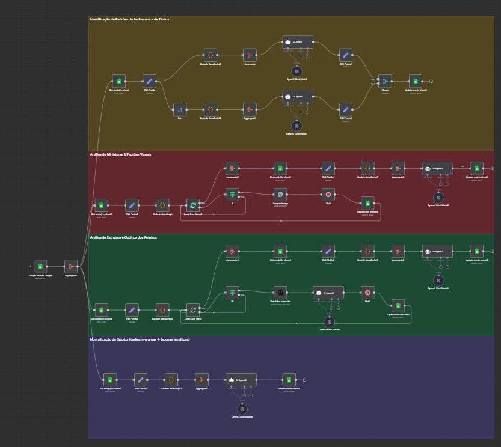

# 🧠 Sistema de Pesquisa de Tendências para YouTube

> Projeto desenvolvido como parte de um processo seletivo técnico, com o objetivo de demonstrar domínio em automação de fluxos com **n8n**, integração com **Google Sheets**, uso de **IA generativa**, e aplicação prática de **engenharia de prompts**.

---

## 📑 Índice

1. [🧩 Visão Geral do Projeto](#-visão-geral-do-projeto)
2. [⚙️ Arquitetura do Sistema](#️-arquitetura-do-sistema)
3. [🎯 Parte 1 — Tratamento de Dados](#-parte-1--tratamento-de-dados)
4. [🔍 Parte 2 — Análise e Identificação de Padrões](#-parte-2--análise-e-identificação-de-padrões)
5. [💡 Parte 3 — Desenvolvimento de Ideias](#-parte-3--desenvolvimento-de-ideias)
6. [📊 Estrutura da Planilha (Google Sheets)](#-estrutura-da-planilha-google-sheets)
7. [🚧 Desafios e Soluções](#-desafios-e-soluções)
8. [📈 Conclusões e Próximos Passos](#-conclusões-e-próximos-passos)

---

## 🧩 Visão Geral do Projeto

O sistema foi projetado para **identificar, analisar e gerar ideias de conteúdo viral** com base em dados reais de títulos de vídeos do YouTube.

A automação completa é dividida em **3 grandes partes**, que se conectam entre si:

| Parte | Nome | Função Principal |
|:------:|------|------------------|
| **1** | **Tratamento de Dados** | Coleta e pré-processamento de títulos para padronização e filtragem inicial. |
| **2** | **Análise e Identificação de Padrões** | Descoberta de estruturas narrativas e padrões visuais de alta performance. |
| **3** | **Desenvolvimento de Ideias** | Geração final de ideias, títulos, roteiros e thumbnails a partir das lacunas detectadas. |

---

## ⚙️ Arquitetura do Sistema

Cada automação é independente, mas compartilha o mesmo **banco de dados no Google Sheets**, permitindo continuidade entre análises e geração de conteúdo.

---

## 🎯 Parte 1 — Tratamento de Dados

📂 **Caminho:**  
`/Sistema-de-Pesquisa-de-Tend-ncias-para-YouTube/Tratamento de Dados/`

### 📌 Objetivo

Realizar a coleta e padronização de dados vindos de planilhas, preparando-os para as análises posteriores.  
Essa etapa inclui filtragem, separação entre títulos de alta e baixa performance e organização de colunas no formato esperado pelos agentes de IA.

> 🖼️ 
 

🔗 [Ver documentação completa da Parte 2 →](/An%C3%A1lise%20e%20Identifica%C3%A7%C3%A3o%20de%20padr%C3%B5es/)

---

## 🔍 Parte 2 — Análise e Identificação de Padrões

📂 **Caminho:**  
`/Sistema-de-Pesquisa-de-Tend-ncias-para-YouTube/Análise e Identificação de padrões/`

### 📌 Objetivo

Analisar os títulos e thumbnails previamente tratados para descobrir **padrões linguísticos e visuais** de sucesso.  
O sistema identifica **estruturas narrativas, gatilhos emocionais, power words e composições visuais** recorrentes nos vídeos de melhor performance.

> 🖼️ 
 

🔗 [Ver documentação completa da Parte 2 →](./Análise%20e%20Identificação%20de%20padrões/README.md)

---

## 💡 Parte 3 — Desenvolvimento de Ideias

📂 **Caminho:**  
`/Sistema-de-Pesquisa-de-Tend-ncias-para-YouTube/Desenvolvimento de Ideias/`

### 📌 Objetivo

Transformar as lacunas e padrões identificados anteriormente em **ideias completas de conteúdo**.  
Esta automação gera:
- Ideia central de vídeo  
- Título otimizado com gatilhos e estrutura testada  
- Roteiro completo para gravação  
- Conceitos de thumbnail  
- Registro automatizado na planilha “Conteúdo”

> 🖼️ 
 

🔗 [Ver documentação completa da Parte 3 →](/Desenvolvimento%20de%20Ideias/)

---

## 📊 Estrutura da Planilha (Google Sheets)

> 🖼️ 
 

A planilha funciona como **hub central de dados** do sistema.  
Cada aba representa uma fase do pipeline:

| Aba | Função |
|------|--------|
| `Dados ordenados` | Armazena todos os títulos com métricas originais. |
| `Identificação de padrões` | Recebe análises de estrutura, emoção e thumbnail. |
| `Conteúdo` | Guarda ideias, títulos, roteiros e conceitos finais. |

---

## 🚧 Desafios e Soluções

Durante o desenvolvimento, alguns desafios técnicos se destacaram:

### 1. Limitação de Requisições (Google API)
> A solução foi implementar **delays automáticos (`Wait 20s`)** e controle de fluxo por lotes.

### 2. Normalização de Dados
> Foi criado um **script de limpeza e corte de sufixos**, garantindo que nomes de canais ou caudas não interferissem na análise semântica.

### 3. Estruturação de Prompts
> Cada agente foi desenhado com **prompts em Markdown estruturados** e áreas de preenchimento manual, assegurando reprodutibilidade e clareza.

### 4. Consolidação dos Resultados
> O uso de **blocos `Aggregate` e scripts `Code` em JavaScript** padronizou o formato JSON e otimizou a gravação de resultados.

---

## 📈 Conclusões e Próximos Passos

O projeto demonstra o potencial do uso de **IA aplicada à análise de tendências** e **automação de conteúdo**.  
Entre os aprendizados mais relevantes estão:

- Criação de fluxos complexos integrados em n8n;  
- Uso de agentes especializados com contexto controlado;  
- Estruturação de dados para análises replicáveis;  
- Engenharia de prompts em formato técnico e padronizado.

### 🚀 Próximos passos
- Expandir o modelo para outros nichos (ex: saúde, finanças, beleza).  
- Adicionar etapa de validação automática de performance (CTR simulado).  
- Conectar o pipeline diretamente à API do YouTube Data v3 para coleta em tempo real.

---

📘 **Autor:** *Guilherme Silva*  
💼 *Projeto desenvolvido como parte de um processo seletivo técnico em IA aplicada e automação de conteúdo.*

---
