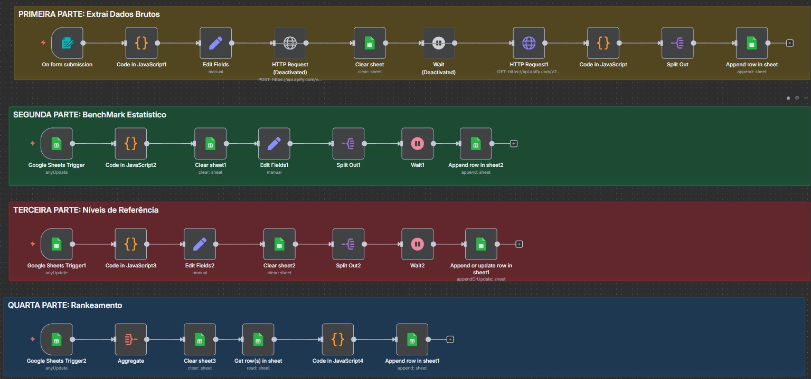

# Sistema-de-Pesquisa-de-Tend-ncias-para-YouTube

**# Resumo Workflow 



## 🔄 4 Partes

### **Automação 1: Raspagem de Dados**
Faz raspagem de vídeos do YouTube usando um actor do Apify. Recebe nicho, quantidade e filtro via formulário web, aguarda 10 minutos o processamento e salva ~50 vídeos com métricas calculadas (engagementRate, outlierScore, viewsPerDay, etc.) na planilha DADOSBRUTOS.

**Tempo:** ~12 minutos

---

### **Automação 2: Cálculo de Benchmarks**
Processa todos os vídeos e calcula 13 estatísticas (média, mediana, desvio padrão, percentis P10-P99, etc.) para cada uma das 12 métricas. Cria uma tabela de referências estatísticas do nicho na aba BenchMark.

**Tempo:** ~3 segundos

---

### **Automação 3: Níveis de Referência**
Transforma as estatísticas em 6 níveis de performance compreensíveis (Excepcional/Top 1%, Excelente/Top 5%, Muito Bom/Top 10%, Bom/Top 25%, Médio/Mediana, Abaixo da Média/Bottom 25%) e salva na aba ANÁLISE.

**Tempo:** <1 segundo

---

### **Automação 4: Ranking**
Compara cada vídeo com os benchmarks, calcula um score composto (0-100) usando pesos para 7 métricas, classifica e marca flags especiais (topPerformer, viralPotential, smallChannelWin). Remove duplicatas e ordena por score na aba "Dados ordenados".

**Pesos do Score:**
- Views: 25%, EngagementRate: 20%, OutlierScore: 20%, ViewsPerDay: 15%, LikeRate: 10%, CommentRate: 5%, TotalEngagementRate: 5%

**Tempo:** <1 segundo

---

## 🚧 Dificuldades

**Principal desafio:** Definir um rankeamento justo com pesos equilibrados que reflitam o que realmente importa no YouTube. Como balancear views (popularidade), engagement (qualidade), outlier score (viralização) e velocidade de crescimento em um único score?

---

## 🔧 Melhorias Futuras

### 1. **Substituir Apify por Scraper Próprio**
Actor do Apify é rápido e confiável, mas tem custo. Desenvolver scraper em Python eliminaria custos recorrentes.

### 2. **Multi-idioma Automático**
Atualmente busca só no idioma do termo pesquisado. Fazer requisições paralelas nos 5 idiomas mais falados (EN, ES, PT, FR, HI) e unificar na base enriqueceria os dados.

### 3. **Banco de Dados Real**
Google Sheets perde histórico a cada execução. Migrar para Supabase/Baserow permitiria múltiplas pesquisas simultâneas e análise temporal.

### 4. **Pesos Dinâmicos por Nicho**
Pesos fixos não se adaptam. Nichos diferentes têm prioridades diferentes (entretenimento = viralização, educação = engajamento).

### 5. **Detecção de Outliers com Desvio Padrão**
O código calcula desvio padrão mas não o usa para detectar outliers estatisticamente. Implementar Z-score ou IQR para identificação mais rigorosa.

---

## 💡 Vantagem Principal

**Benchmarks dinâmicos por nicho.** Cada nicho cria suas próprias referências de sucesso - o que é "viral" em um nicho pode ser mediano em outro. O sistema se adapta automaticamente ao contexto específico da pesquisa.**


# 🧭 Resumo Geral — Automação **Parte 2** (4 passos)


> Visão macro e encadeamento entre as quatro partes. Mantém o seu padrão (títulos, blocos, limitações, planilhas e pontos de escrita).

---

## 1) 🎯 **Parte 1 — Identificação de Padrões de Performance de Títulos**

**Objetivo**
Mapear padrões estruturais em títulos com base na planilha **Dados ordenados**.

**Fluxo (alto nível)**

```
Google Sheets Trigger (1 min)
→ Get row(s) in sheet
→ Edit Fields (normalizações)
→ (Caminho TOP) Code (limita 50) → Aggregate → AI Agent (análise positiva) → Edit Fields1
→ (Caminho OUTRO) Sort → Code (limita 50) → Aggregate1 → AI Agent1 (análise complementar) → Edit Fields2
→ Merge
→ Update row in sheet2 (grava padrões de títulos)
```

**Entrada**

* Linhas de **Dados ordenados** (títulos e metadados).

**Processamento**

* Seleção e limitação de amostras (até **50** por caminho).
* Agentes de IA geram **JSON padronizado** com padrões, power words, elementos formais, diretrizes.

**Saída**

* Padrões consolidados de **títulos** em **Identificação de padrões** (colunas conforme sua estrutura: ex. `TituloPositivo`, `TituloNegativo` ou similar definido por você).

**Limites/Notas**

* Máx. **50** por análise/caminho.
* **Prompt**: colado manualmente no bloco “📍 Prompt” de cada agente.

---

## 2) 🖼️ **Parte 2 — Análise de Thumbnails & Padrões Visuais**

**Objetivo**
Descrever tecnicamente as **thumbnails** dos **50 primeiros registros** e consolidar **padrões visuais**.

**Fluxo (alto nível)**

```
Google Sheets Trigger (1 min)
→ Get row(s) in sheet1 (Dados ordenados)
→ Edit Fields3 (mapeia URL da thumb em "")
→ Code (limita 50)
→ Loop Over Items2
   ├─ If (DescriçãoThumb vazia?) → Analyze image → Wait (20s) → Update row in sheet (preenche DescriçãoThumb)
   └─ (se não, segue)
→ Aggregate2 → Get row(s) in sheet2 → Edit Fields4
→ Code1 (limita 50) → Aggregate3 (consolida DescriçãoThumb)
→ AI Agent2 (padrões visuais a partir das descrições TOP)
→ Update row in sheet1 (Identificação de padrões!Thumb = output, linha 2)
```

**Entrada**

* **Thumb** (URL) e `row_number` dos **50 primeiros** itens.

**Processamento**

* Geração de **DescriçãoThumb** (quando vazia).
* Consolidação de descrições e extração de **padrões visuais** (cores, composição, texto, elementos de destaque, expressões).

**Saída**

* JSON de **padrões visuais** em **Identificação de padrões → linha 2 → coluna `Thumb`**.

**Limites/Notas**

* Processa **até 50**; só descreve se `DescriçãoThumb` **estiver vazia**.
* **Prompt** dos nós de IA inserido manualmente (bloco “📍 Prompt”).

---

## 3) 📜 **Parte 3 — Análise de Estrutura e Gatilhos dos Roteiros**

**Objetivo**
Avaliar **transcrições** dos **50 primeiros** itens para extrair **estrutura narrativa** e **gatilhos de copy**.

**Fluxo (alto nível)**

```
Google Sheets Trigger (1 min)
→ Get row(s) in sheet (Dados ordenados)
→ Edit Fields (transcricao, row_number)
→ Code (limita 50)
→ (Loop condicional, se aplicável no seu fluxo)
→ AI Agent3 (análise por vídeo) → Wait
→ Update row in sheet (Transcrição = JSON de análise)
→ Aggregate → Get row(s) → Edit Fields → Code (limita 50)
→ Aggregate (coleta análises) → AI Agent4 (sumário de padrões narrativos)
→ Update row in sheet (Identificação de padrões!Roteiro = output, linha 2; Thumb="=")
```

**Entrada**

* `Transcrição` (ou fonte para obtê-la) + `row_number`.

**Processamento**

* Para itens sem análise prévia, gera **análise estruturada** (JSON) por vídeo.
* Consolida **padrões narrativos** em nível de conjunto.

**Saída**

* JSON de **padrões narrativos** em **Identificação de padrões → linha 2 → coluna `Roteiro`** (e `Thumb = "="` conforme seu fluxo).

**Limites/Notas**

* Máx. **50**; `Transcrição` pode **armazenar a análise JSON** (se quiser preservar o texto bruto, usar outra coluna).
* **Prompt** colado manualmente.

---

## 4) 🧩 **Parte 4 — Normalização de Oportunidades (n-gramas → lacunas)**

**Objetivo**
Transformar **padrões raros-fortes de n-gramas** (extraídos dos títulos da própria base) em **lacunas temáticas** com **score** e **exemplos reais**.

**Fluxo (alto nível)**

```
Google Sheets Trigger (1 min)
→ Get row(s) in sheet (Dados ordenados)
→ Edit Fields8 (row_number, Titulo, outlierScore)
→ Code in JavaScript7 (extrai n-gramas 2–3; p75/p90; topK 10% até 50; raridade 2–6)
→ Aggregate7 (consolida em um item)
→ AI Agent6 (normaliza em 10 lacunas máx.) [gpt-4o-mini]
→ Update row in sheet (Identificação de padrões!Lacunas = output, linha 2)
```

**Entrada**

* `Titulo`/`outlierScore` de **toda a base** lida (o corte de 50 aqui é **para topK**, não para a base).

**Processamento**

* Normalização/tokenização; filtros de **âncoras de domínio** e **ruído**.
* Seleção de n-gramas **raros (2–6)** e **fortes (≥ p75; prioriza p90+)** com presença em **TOP**.
* Agente consolida **10 lacunas** (máx.) com **scoreEstimado (60–95)**.

**Saída**

* JSON de **Lacunas** em **Identificação de padrões → linha 2 → coluna `Lacunas`**.

**Limites/Notas**

* Script retorna **até 20 padrões**; o agente reduz para **até 10 lacunas**.
* **Prompt** do agente colado manualmente.

---

## 🔗 **Encadeamento e Consumo**

* **Parte 1** produz **padrões de títulos** → servem como base para criação/otimização de headlines.
* **Parte 2** produz **padrões visuais** (a partir de descrições TOP) → dá diretrizes de thumbnail.
* **Parte 3** produz **padrões narrativos** → orienta estrutura/roteiro e gatilhos de copy.
* **Parte 4** produz **lacunas temáticas priorizadas** → pauta de conteúdo com maior potencial (junção de força x raridade x presença em TOP).

**Ponto Único de Consulta**
Tudo converge em **Identificação de padrões (row 2)**, com colunas **Thumb / Roteiro / Lacunas** (e as de títulos conforme sua escolha), padronizando o consumo por qualquer etapa seguinte (ex.: geração de ideias, briefs, roteiros e thumbnails).

---

Se quiser, eu já transformo esse **Resumo Geral** num bloco final do seu README da **Parte 2**, mantendo seus ícones/estilo e incluindo os **blocos “📍 Prompt”** vazios onde fizer sentido.
