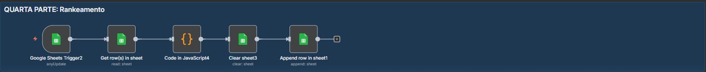

# Parte 4: Ranking e Classificação de Vídeos



## 📋 Visão Geral

Esta quarta e última parte do workflow é responsável por **rankear e classificar todos os vídeos** comparando-os com os benchmarks da Parte 3. Cada vídeo recebe um **score composto**, uma **classificação geral** e **flags especiais** que identificam outliers e oportunidades.

### Objetivo
Criar um ranking ordenado de vídeos com scores e classificações baseados em múltiplas métricas, identificando automaticamente os vídeos de maior potencial para análise pelo LLM.

---

## 🔄 Fluxo de Execução

```
Trigger (Níveis Atualizados) → Buscar Dados Brutos → Rankear e Classificar → Limpar Aba → Salvar Ranking
```

---

## 📦 Nós do Workflow

### 1. **Google Sheets Trigger2** (Trigger Automático)
**Tipo:** `n8n-nodes-base.googleSheetsTrigger`

**Função:** Monitora a aba ANÁLISE e dispara quando a Parte 3 termina de calcular os níveis de performance.

**Configuração:**
- **Polling:** A cada 1 minuto
- **Documento:** Teste Dev IA Pleno (`1XlZTABwHA456bYCFRiS8BFLxynypmo65pXeBeRV1WkQ`)
- **Aba:** ANÁLISE (`gid=78424668`)
- **Credenciais:** Google Sheets Trigger OAuth2

**Comportamento:**
- Detecta quando a Parte 3 insere os 6 níveis
- Captura todos os níveis de performance
- Passa os dados para o próximo nó

**Input Recebido (pinData):**
```json
[
  {
    "Nível": "Excepcional - Top 1%",
    "view": 2580437,
    "engagementRate": "31.25",
    "likeRate": "312.5",
    "commentRate": "162.16",
    "totalEngagementRate": "40.54",
    "viewsPerDay": 11831,
    "outlierScore": "6102.94"
  },
  {
    "Nível": "Excelente - Top 5%",
    "view": 760130,
    "engagementRate": "11.76",
    // ... outros níveis
  }
]
```

---

### 2. **Get row(s) in sheet** (Buscar Dados Brutos)
**Tipo:** `n8n-nodes-base.googleSheets`

**Função:** Busca **TODOS os vídeos** da aba DADOSBRUTOS para rankear.

**Configuração:**
- **Operação:** Get All Rows
- **Documento:** Teste Dev IA Pleno
- **Aba:** DADOSBRUTOS (`gid=0`)

**Por que buscar novamente?**
O trigger só passa os níveis (6 linhas). Precisamos dos dados completos dos vídeos (50+ linhas) para rankear cada um deles.

**Output:**
Array com todos os vídeos processados na Parte 1:
```json
[
  {
    "Termo de Pesquisa": "weak legs",
    "ID": "abc123",
    "Titulo ": "5 Exercícios Para Pernas Fracas",
    "View": 150000,
    "Likes": 5000,
    // ... todos os campos
  },
  // ... mais vídeos
]
```

---

### 3. **Code in JavaScript4** (Motor de Ranking e Classificação)
**Tipo:** `n8n-nodes-base.code`

**Função:** Núcleo da Parte 4. Compara cada vídeo com os benchmarks e gera ranking completo.

#### **Estrutura do Código**

##### A. Separação dos Dois Inputs

```javascript
// BENCHMARKS: Vêm do trigger (6 níveis)
const benchmarksItems = $('Google Sheets Trigger2').all();

// VÍDEOS: Vêm do input atual (todos os vídeos)
const videosItems = $input.all();
```

**Importante:** O código referencia o nó anterior **pelo nome** usando `$('Google Sheets Trigger2')`.

##### B. Conversão de Benchmarks para Estrutura Utilizável

```javascript
const benchmarks = {
  view: {
    p99: 2580437,  // Excepcional
    p95: 760130,   // Excelente
    p90: 334378,   // Muito Bom
    p75: 11486,    // Bom
    p50: 381,      // Médio
    p25: 52        // Abaixo da Média
  },
  engagementRate: {
    p99: 31.25,
    p95: 11.76,
    p90: 6.67,
    // ...
  },
  // ... todas as 7 métricas
}
```

**Função auxiliar:**
```javascript
function parseValue(value) {
  if (value === "" || value === null || value === undefined) return 0;
  const parsed = parseFloat(value);
  return isNaN(parsed) ? 0 : parsed;
}
```

##### C. Funções de Classificação

**1. Classificar por Métrica:**
```javascript
function classificarMetrica(valor, benchmark) {
  if (valor >= benchmark.p99) return { nivel: 'Excepcional', pontos: 100 };
  if (valor >= benchmark.p95) return { nivel: 'Excelente', pontos: 90 };
  if (valor >= benchmark.p90) return { nivel: 'Muito Bom', pontos: 80 };
  if (valor >= benchmark.p75) return { nivel: 'Bom', pontos: 70 };
  if (valor >= benchmark.p50) return { nivel: 'Médio', pontos: 50 };
  if (valor >= benchmark.p25) return { nivel: 'Abaixo da Média', pontos: 30 };
  return { nivel: 'Muito Baixo', pontos: 10 };
}
```

**Exemplo:**
- Vídeo com 500k views
- Benchmark p90 = 334k
- Resultado: `{ nivel: 'Muito Bom', pontos: 80 }`

**2. Calcular Percentil Rank:**
```javascript
function calcularPercentilRank(valor, benchmark) {
  if (valor >= benchmark.p99) return 99;
  if (valor >= benchmark.p95) return 95;
  if (valor >= benchmark.p90) return 90;
  if (valor >= benchmark.p75) return 75;
  if (valor >= benchmark.p50) return 50;
  if (valor >= benchmark.p25) return 25;
  return 10;
}
```

##### D. Processamento de Cada Vídeo

Para cada vídeo:

**1. Extrair Dados:**
```javascript
const video = {
  id: data.ID || data.id,
  titulo: data["Titulo "] || data.Titulo,
  view: parseFloat(data.View || data.view || 0),
  engagementRate: parseFloat(data.EngajamentoRate || 0),
  outlierScore: parseFloat(data.outlierScore || 0),
  // ... todas as métricas
}
```

**2. Classificar Cada Métrica:**
```javascript
const classificacoes = {
  view: classificarMetrica(video.view, benchmarks.view),
  engagementRate: classificarMetrica(video.engagementRate, benchmarks.engagementRate),
  outlierScore: classificarMetrica(video.outlierScore, benchmarks.outlierScore),
  viewsPerDay: classificarMetrica(video.viewsPerDay, benchmarks.viewsPerDay),
  likeRate: classificarMetrica(video.likeRate, benchmarks.likeRate),
  commentRate: classificarMetrica(video.commentRate, benchmarks.commentRate),
  totalEngagementRate: classificarMetrica(video.totalEngagementRate, benchmarks.totalEngagementRate)
}
```

**3. Calcular Score Composto (Média Ponderada):**
```javascript
const scoreComposto = (
  (classificacoes.view.pontos * 0.25) +           // 25% views
  (classificacoes.engagementRate.pontos * 0.20) + // 20% engagement
  (classificacoes.outlierScore.pontos * 0.20) +   // 20% outlier
  (classificacoes.viewsPerDay.pontos * 0.15) +    // 15% views/dia
  (classificacoes.likeRate.pontos * 0.10) +       // 10% like rate
  (classificacoes.commentRate.pontos * 0.05) +    // 5% comment rate
  (classificacoes.totalEngagementRate.pontos * 0.05) // 5% total engagement
)
```

**Pesos das Métricas:**
| Métrica | Peso | Justificativa |
|---------|------|---------------|
| view | 25% | Principal indicador de sucesso |
| engagementRate | 20% | Qualidade do engajamento |
| outlierScore | 20% | Viralização acima da média do canal |
| viewsPerDay | 15% | Velocidade de crescimento |
| likeRate | 10% | Taxa de aprovação |
| commentRate | 5% | Interação dos espectadores |
| totalEngagementRate | 5% | Engajamento total |

**Exemplo de Cálculo:**
```
Vídeo:
- view: 450k → 80 pontos (Muito Bom)
- engagementRate: 4.0% → 80 pontos (Muito Bom)
- outlierScore: 100 → 90 pontos (Excelente)
- viewsPerDay: 5000 → 80 pontos (Muito Bom)
- likeRate: 40 → 80 pontos (Muito Bom)
- commentRate: 2.5 → 80 pontos (Muito Bom)
- totalEngagementRate: 4.5% → 80 pontos (Muito Bom)

Score = (80*0.25) + (80*0.20) + (90*0.20) + (80*0.15) + (80*0.10) + (80*0.05) + (80*0.05)
Score = 20 + 16 + 18 + 12 + 8 + 4 + 4 = 82 pontos
```

**4. Definir Classificação Geral:**
```javascript
let classificacaoGeral = 'Médio';
if (scoreComposto >= 95) classificacaoGeral = 'Excepcional';
else if (scoreComposto >= 85) classificacaoGeral = 'Excelente';
else if (scoreComposto >= 75) classificacaoGeral = 'Muito Bom';
else if (scoreComposto >= 60) classificacaoGeral = 'Bom';
else if (scoreComposto >= 40) classificacaoGeral = 'Médio';
else if (scoreComposto >= 25) classificacaoGeral = 'Abaixo da Média';
else classificacaoGeral = 'Muito Baixo';
```

**5. Definir Flags Especiais:**
```javascript
const flags = {
  topPerformer: scoreComposto >= 85,                     // Vídeo top (Excelente ou Excepcional)
  viralPotential: video.outlierScore > benchmarks.outlierScore.p90,  // Viralização alta
  highEngagement: video.engagementRate > benchmarks.engagementRate.p75,  // Engajamento alto
  rapidGrowth: video.viewsPerDay > benchmarks.viewsPerDay.p90,  // Crescimento rápido
  smallChannelWin: video.inscritos < 10000 && video.outlierScore > benchmarks.outlierScore.p75  // Canal pequeno com sucesso
}
```

**Interpretação das Flags:**
- **topPerformer**: Candidato prioritário para análise
- **viralPotential**: Vídeo com potencial de viralização
- **highEngagement**: Audiência muito engajada
- **rapidGrowth**: Crescimento acelerado
- **smallChannelWin**: Sucesso desproporcional (canal pequeno com vídeo viral)

##### E. Deduplicação

```javascript
// Remover duplicatas usando ID como chave única
const videosUnicosMap = new Map();

videosRankeados.forEach(video => {
  const chaveUnica = video.id;
  
  if (!videosUnicosMap.has(chaveUnica)) {
    videosUnicosMap.set(chaveUnica, video);
  } else {
    // Se já existe, manter o com maior score
    const videoExistente = videosUnicosMap.get(chaveUnica);
    if (video.scoreComposto > videoExistente.scoreComposto) {
      videosUnicosMap.set(chaveUnica, video);
    }
  }
});
```

##### F. Ordenação e Posição no Ranking

```javascript
// Ordenar por score (maior para menor)
videosFinais.sort((a, b) => b.scoreComposto - a.scoreComposto);

// Adicionar posição no ranking
videosFinais.forEach((video, index) => {
  video.posicaoRanking = index + 1;
});
```

##### G. Estatísticas do Ranking

```javascript
const stats = {
  totalVideos: videosFinais.length,
  videosOriginais: videosRankeados.length,
  duplicatasRemovidas: videosRankeados.length - videosFinais.length,
  topPerformers: videosFinais.filter(v => v.flags.topPerformer).length,
  viralVideos: videosFinais.filter(v => v.flags.viralPotential).length,
  highEngagementVideos: videosFinais.filter(v => v.flags.highEngagement).length,
  smallChannelWins: videosFinais.filter(v => v.flags.smallChannelWin).length,
  
  distribuicao: {
    excepcional: videosFinais.filter(v => v.classificacaoGeral === 'Excepcional').length,
    excelente: videosFinais.filter(v => v.classificacaoGeral === 'Excelente').length,
    muitoBom: videosFinais.filter(v => v.classificacaoGeral === 'Muito Bom').length,
    bom: videosFinais.filter(v => v.classificacaoGeral === 'Bom').length,
    medio: videosFinais.filter(v => v.classificacaoGeral === 'Médio').length,
    abaixoDaMedia: videosFinais.filter(v => v.classificacaoGeral === 'Abaixo da Média').length,
    muitoBaixo: videosFinais.filter(v => v.classificacaoGeral === 'Muito Baixo').length
  }
}
```

#### **Output do Código:**

Array de vídeos rankeados, cada um com:

```json
{
  // Dados originais
  "id": "abc123",
  "titulo": "5 Exercícios Para Pernas Fracas",
  "link": "https://youtube.com/watch?v=abc123",
  "thumb": "https://i.ytimg.com/...",
  "canal": "Saúde Senior",
  "view": 450000,
  "likes": 15000,
  "comentarios": 950,
  "inscritos": 580000,
  "diasPublicado": 45,
  "duracaoSegundos": 624,
  "formatoVideo": "médio",
  "engagementRate": 3.33,
  "likeRate": 33.33,
  "commentRate": 2.11,
  "totalEngagementRate": 3.55,
  "viewsPerDay": 10000,
  "outlierScore": 77.59,
  
  // Rankings e scores
  "posicaoRanking": 1,
  "scoreComposto": 82.5,
  "classificacaoGeral": "Muito Bom",
  
  // Classificações por métrica
  "classificacoes": {
    "view": "Muito Bom",
    "engagementRate": "Muito Bom",
    "outlierScore": "Excelente",
    "viewsPerDay": "Muito Bom",
    "likeRate": "Muito Bom",
    "commentRate": "Muito Bom"
  },
  
  // Percentis
  "percentilRanks": {
    "view": 90,
    "engagementRate": 90,
    "outlierScore": 95,
    "viewsPerDay": 90
  },
  
  // Flags especiais
  "flags": {
    "topPerformer": false,
    "viralPotential": true,
    "highEngagement": true,
    "rapidGrowth": true,
    "smallChannelWin": false
  }
}
```

**Console Logs:**
```
📥 Benchmarks recebidos de "Google Sheets Trigger2": 6
🎬 Vídeos recebidos: 50
✅ Benchmarks reconstruídos
📊 view p99: 2580437
📊 engagementRate p99: 31.25
📊 outlierScore p90: 722.67
📊 viewsPerDay p99: 11831
🚀 Iniciando rankeamento de 50 vídeos...

✅ RANKEAMENTO CONCLUÍDO!
⏱️  Tempo: 0.85s
📊 Vídeos processados: 50
🎯 Vídeos únicos: 50
🔄 Duplicatas removidas: 0

🏆 TOP 5 VÍDEOS:
   1. 5 Exercícios Para Pernas Fracas Após os 60... (Score: 85.2)
   2. Você Tem Pernas Fracas? Faça ISSO Todos os ... (Score: 82.7)
   3. Como Fortalecer Pernas em Casa - Iniciantes... (Score: 79.5)
   4. Pernas Fracas? 3 Sinais de Alerta que Você ... (Score: 76.8)
   5. Exercícios Para Idosos: Fortaleça Suas Pern... (Score: 74.2)

📈 DISTRIBUIÇÃO:
   Excepcional: 2
   Excelente: 5
   Muito Bom: 12
   Bom: 18
```

---

### 4. **Clear sheet3** (Limpeza)
**Tipo:** `n8n-nodes-base.googleSheets`

**Função:** Limpa a aba "Dados ordenados" antes de inserir o ranking.

**Configuração:**
- **Operação:** Clear
- **Documento:** Teste Dev IA Pleno
- **Aba:** Dados ordenados (`gid=304295346`)
- **Manter cabeçalho:** Sim

---

### 5. **Append row in sheet1** (Salvamento)
**Tipo:** `n8n-nodes-base.googleSheets`

**Função:** Insere cada vídeo rankeado na planilha.

**Configuração:**
- **Operação:** Append
- **Documento:** Teste Dev IA Pleno
- **Aba:** Dados ordenados (`gid=304295346`)

**Colunas da Planilha:**
1. ID
2. Titulo
3. Link
4. Thumb
5. FormatoVideo
6. EngajamentoRate
7. LikeRate
8. CommetRate
9. totalEngagement
10. totalEngagementRate
11. viewsPerDay
12. outlierScore
13. **Score Final** ← scoreComposto
14. **ClassificaçãoGeral** ← classificacaoGeral
15. **Classificação** ← classificacoes (objeto)
16. **Flags** ← flags (objeto)

**Observação:** Os campos `Classificação` e `Flags` são objetos JSON serializados como string.

---

## 📊 Estrutura Final no Google Sheets (Aba "Dados ordenados")

| ID | Titulo | Link | Score Final | ClassificaçãoGeral | Flags |
|----|--------|------|-------------|-------------------|-------|
| abc123 | 5 Exercícios Para Pernas Fracas... | https://... | 85.2 | Excelente | {"topPerformer":true,"viralPotential":true,...} |
| def456 | Você Tem Pernas Fracas? Faça... | https://... | 82.7 | Muito Bom | {"topPerformer":false,"viralPotential":true,...} |
| ... | ... | ... | ... | ... | ... |

**Ordenação:** Decrescente por Score Final (melhor primeiro)

---

## 🎯 Interpretação do Ranking

### Score Composto (0-100)

| Faixa | Classificação | Interpretação |
|-------|---------------|---------------|
| 95-100 | Excepcional | Vídeo extraordinário, mega viral |
| 85-94 | Excelente | Vídeo de grande sucesso |
| 75-84 | Muito Bom | Performance acima da média |
| 60-74 | Bom | Performance sólida |
| 40-59 | Médio | Performance típica do nicho |
| 25-39 | Abaixo da Média | Performance fraca |
| 0-24 | Muito Baixo | Performance muito ruim |

### Uso das Flags

**Para seleção de vídeos para análise:**
1. **topPerformer = true**: Prioridade máxima (top 10-15%)
2. **viralPotential = true**: Outliers interessantes
3. **smallChannelWin = true**: Padrões de sucesso replicáveis

**Para identificar padrões:**
- Vídeos com múltiplas flags verdadeiras são candidatos ideais
- `highEngagement` + `rapidGrowth` = tendência quente
- `smallChannelWin` = estratégia eficaz independente de tamanho

---

## ⚙️ Configurações Técnicas

### Referência Entre Nós
**Crítico:** O código usa referência explícita por nome:
```javascript
const benchmarksItems = $('Google Sheets Trigger2').all();
```

Se o nome do nó mudar, o código quebra. Alternativa:
```javascript
const benchmarksItems = $node["Google Sheets Trigger2"].all();
```

### Performance
- **Processamento:** ~0.5-1s para 50 vídeos
- **Complexidade:** O(n) para ranking, O(n log n) para ordenação
- **Memória:** Eficiente com Map para deduplicação

### Credenciais
- **Google Sheets Trigger:** OAuth2 (`6Z6MEbvijNLMdskV`)
- **Google Sheets API:** OAuth2 (`KrBqg4twP2wKcI6z`)

---

## 🔄 Integração com Outras Partes

### Input:
- **Parte 3:** 6 níveis de performance (via trigger)
- **Parte 1:** Todos os vídeos com métricas calculadas (via Get Rows)

### Output:
- **Aba "Dados ordenados"**: Ranking completo e ordenado
- **Próxima etapa:** Análise com LLM (não incluída neste workflow)

---

## 📈 Benefícios do Ranking

### 1. Identificação Rápida de Outliers
Vídeos com `topPerformer = true` são automaticamente os melhores candidatos.

### 2. Priorização para Análise Humana/LLM
- Top 10 vídeos (score > 85): Análise profunda
- Vídeos com flags especiais: Análise de padrões
- Bottom 10%: Evitar padrões

### 3. Base para Geração de Insights
O LLM pode receber:
```
"Analise os 15 vídeos top performers (score > 80) 
e identifique padrões de títulos, ganchos e temas"
```

### 4. Validação de Oportunidades
Uma sugestão de tema deve visar:
- Score estimado: > 75
- Flags esperadas: viralPotential, highEngagement

---

## 🎯 Resultado Final da Parte 4

**Input:** 
- 6 níveis de performance (Parte 3)
- 50+ vídeos com métricas (Parte 1)

**Output:**
- Ranking completo e ordenado
- Score composto para cada vídeo
- Classificações detalhadas por métrica
- Flags especiais identificando oportunidades
- Estatísticas da distribuição

**Próxima Etapa:** 
Este ranking serve como input para análise com LLM, que irá:
1. Analisar os top performers
2. Identificar padrões de sucesso
3. Gerar as 15 sugestões de temas finais

---

## 💡 Notas de Implementação

### Ajuste de Pesos
Os pesos do score composto podem ser ajustados conforme o nicho:
```javascript
// Para nichos de entretenimento (priorizar viralização):
view: 0.30, outlierScore: 0.25, engagement: 0.15

// Para nichos educacionais (priorizar engajamento):
engagement: 0.30, view: 0.20, outlierScore: 0.20
```

### Flags Customizadas
Adicione flags específicas do seu nicho:
```javascript
flags.trendy = video.diasPublicado < 30 && video.viewsPerDay > benchmarks.viewsPerDay.p90;
flags.evergreen = video.diasPublicado > 180 && video.viewsPerDay > benchmarks.viewsPerDay.p50;
```

### Threshold de Deduplicação
Atualmente usa apenas ID. Para deduplicação mais sofisticada:
```javascript
const similarity = calculateTitleSimilarity(video.titulo, videoExistente.titulo);
if (similarity > 0.85) { /* considerar duplicata */ }
```
